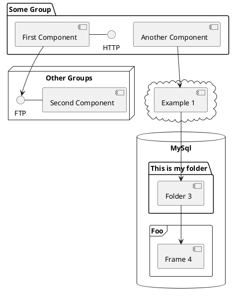

# What is this page?

Use the different functionalities to check they are ok and are displayed nicely.

## Simple content

Lorem ipsum dolor sit amet, consectetur adipiscing elit, sed do eiusmod tempor incididunt ut labore et dolore magna aliqua. Consequat ac felis donec et odio pellentesque diam volutpat. Auctor eu augue ut lectus. In hendrerit gravida rutrum quisque non. Quisque sagittis purus sit amet volutpat consequat mauris nunc. Vestibulum lorem sed risus ultricies tristique. Aenean vel elit scelerisque mauris pellentesque pulvinar. Cras semper auctor neque vitae tempus quam. Fusce id velit ut tortor pretium viverra suspendisse. Nullam vehicula ipsum a arcu cursus vitae congue mauris. Auctor eu augue ut lectus arcu bibendum at varius. Quam pellentesque nec nam aliquam sem et. Interdum velit euismod in pellentesque massa placerat duis ultricies. Aliquet eget sit amet tellus cras adipiscing enim eu. Purus gravida quis blandit turpis cursus in hac habitasse platea. In pellentesque massa placerat duis ultricies lacus sed. Dignissim enim sit amet venenatis urna cursus eget.

Ac turpis egestas maecenas pharetra. Morbi quis commodo odio aenean sed adipiscing. Vitae suscipit tellus mauris a diam maecenas sed enim ut. Pretium aenean pharetra magna ac placerat vestibulum. Sit amet venenatis urna cursus. Non blandit massa enim nec dui nunc mattis. Pellentesque pulvinar pellentesque habitant morbi tristique senectus et netus et. Et malesuada fames ac turpis egestas maecenas pharetra convallis posuere. Platea dictumst quisque sagittis purus sit amet volutpat consequat mauris. At imperdiet dui accumsan sit amet nulla facilisi morbi tempus. Nibh tortor id aliquet lectus proin nibh nisl. Venenatis lectus magna fringilla urna porttitor. Lacinia at quis risus sed vulputate. Tristique risus nec feugiat in fermentum. Aliquam etiam erat velit scelerisque in dictum non consectetur.

## Hints

!> Here is a tip.

?> And a warning.

x> Or an error.

Hints are implemented by

- Using [remark hint processor](https://github.com/sergioramos/remark-hint) to add the relevant classes
- Adding the relevant css (::before) to the relevant classes which add the icons


## Table

Ingredient | Calories | Protein | Fat | Carbons
-----------|----------|---------|-----|----------
1          | 50       | 4       | 10  | 25
2          | 30       | 5       | 4   | 32
3          | 60       | 8       | 7   | 12

## Plantuml



## Code Block

```c
float Q_rsqrt( float number )
{
	long i;
	float x2, y;
	const float threehalfs = 1.5F;

	x2 = number * 0.5F;
	y  = number;
	i  = * ( long * ) &y;                       // evil floating point bit level hacking
	i  = 0x5f3759df - ( i >> 1 );               // what the fuck? 
	y  = * ( float * ) &i;
	y  = y * ( threehalfs - ( x2 * y * y ) );   // 1st iteration
//	y  = y * ( threehalfs - ( x2 * y * y ) );   // 2nd iteration, this can be removed

	return y;
}
```

## Graphviz (DOT)

```plantuml

graph g {
	layout=fdp # Specify used layout engine

	bgcolor="#ffffff00"
	overlap=scale

	start=2
	edge [penwidth=0.75,arrowsize=0.6]
	edge [color=black, fontsize=8, forcelabels=true]

	node [
			shape=circle,
			fixedsize=true,
			width=0.25,
			color="black",
			fillcolor="white",
			style="filled,solid",
			fontsize=12,
		];

	node1 [label="s₁"] # u+2081 (yes, it can do unicode!)
	node2 [label="s₂"]
	node3 [label="s₃"]
	node4 [label="t₁",pos="0,0"]
	node5 [label="t₂",pos="0,1"]
	node6 [label="t₃",pos="1,1"]
	node7 [label="t₄",pos="1,0"]

	subgraph clusterG0 {
		label="G∪T" # union u+222a


		subgraph clusterG1 {
				label="G"
				bgcolor=white
				node1 -- node2
				node2 -- node3
				node3 -- node1
		}

		node3 -- node6 [style=dashed,penwidth=1]

		subgraph clusterG2 {
				label="H"
				bgcolor=white
				node4 -- node5
				node5 -- node6
				node6 -- node4
				node6 -- node7
		}
	}
}
```